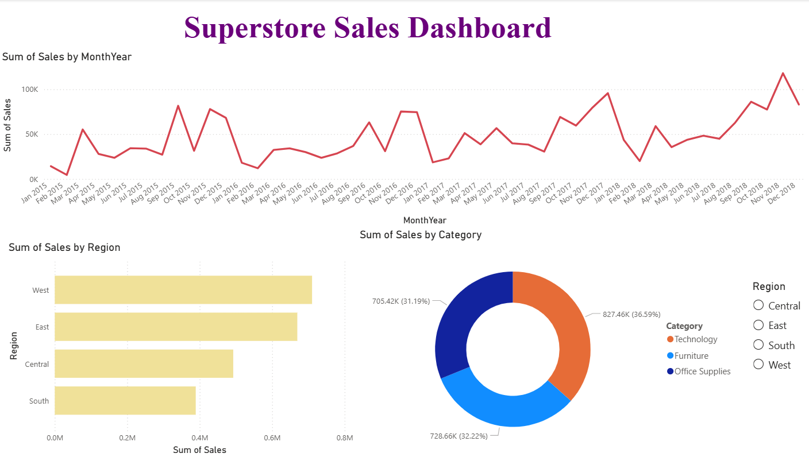

# 📊 Superstore Sales Dashboard – Power BI Project

## 📌 Project Overview

This project was completed as part of a Data Analyst Internship Task focused on building a simple yet interactive sales dashboard. The objective was to transform raw transactional sales data into meaningful business insights using Power BI.

The dashboard analyzes sales performance across different months, regions, and product categories. It demonstrates how data visualization can help decision-makers quickly understand trends, identify top-performing areas, and spot potential growth opportunities.

---

## 🛠 Tools & Technologies Used

- **Power BI Desktop** – Data visualization and dashboard development
- **Superstore Sales Dataset (train.csv)** – Transactional sales dataset
- **DAX (Data Analysis Expressions)** – For calculated columns and sorting logic

Power BI was selected because it enables interactive dashboards, supports dynamic filtering, and provides business-ready reporting without requiring complex programming.

---

## 📁 Dataset Details

The dataset contains approximately 9,800 rows of order-level sales data. Each row represents a product purchased by a customer.

Key columns used for analysis:

- **Order Date** – Date when the order was placed
- **Region** – Geographic sales region (West, East, Central, South)
- **Category** – Product category (Furniture, Office Supplies, Technology)
- **Sales** – Revenue generated from each transaction

---

## 🔄 Data Preparation & Transformation

The following steps were performed before building the dashboard:

1. Imported the CSV file into Power BI using *Get Data → Text/CSV*.
2. Verified and corrected data types in Power Query Editor:
   - Converted **Order Date** to Date format.
   - Ensured **Sales** column was set to Decimal Number.
3. Created a calculated column to extract Month-Year:
   ```
   MonthYear = FORMAT([Order Date], "MMM YYYY")
   ```
4. Created an additional sorting column to maintain chronological order:
   ```
   MonthYearSort = YEAR([Order Date]) * 100 + MONTH([Order Date])
   ```
5. Sorted MonthYear by MonthYearSort to ensure correct time-series visualization.

No major data cleaning was required beyond type validation.

---

## 📊 Dashboard Components

The dashboard includes the following visuals:

### 1️⃣ Line Chart – Sales Over Months
- Displays monthly sales trends.
- Helps identify growth patterns and seasonal spikes.

### 2️⃣ Bar Chart – Sales by Region
- Compares total sales across regions.
- Clearly highlights top-performing and underperforming regions.

### 3️⃣ Donut Chart – Sales by Category
- Shows percentage contribution of each product category.
- Provides quick understanding of revenue distribution.

### 4️⃣ Region Slicer (Interactive Filter)
- Allows users to filter the entire dashboard by selecting a specific region.
- Enables focused regional performance analysis.

---

## 🎯 Key Insights

1. **West region generated the highest total sales**, indicating strong market performance in that area.
2. **Technology category contributes the largest share of revenue**, followed by Furniture and Office Supplies.
3. Sales show noticeable growth toward the later months of the year, suggesting possible seasonal demand or year-end purchasing trends.
4. South region shows comparatively lower sales, presenting potential opportunities for strategic improvement.

---

## 💼 Business Value

This dashboard provides:

- Clear visibility into sales performance trends.
- Quick comparison across regions and categories.
- Interactive filtering for deeper analysis.
- Data-driven support for strategic business decisions.
- A clean, executive-friendly reporting format.

It demonstrates how structured data can be converted into actionable insights using visualization tools.

---

## 🖼 Dashboard Preview



---

## 📦 Repository Contents

- Superstore Sales Dashboard.png (Dashboard Screenshot)
- train.csv (Dataset used)
- README.md (Project documentation)

---

## ✅ Conclusion

This project showcases the ability to:

- Import and prepare data in Power BI
- Create calculated columns using DAX
- Build interactive visual dashboards
- Extract meaningful business insights
- Present analysis in a professional format

The final outcome is a clean, interactive, and business-ready Sales Performance Dashboard suitable for reporting and decision-making purposes.

---

